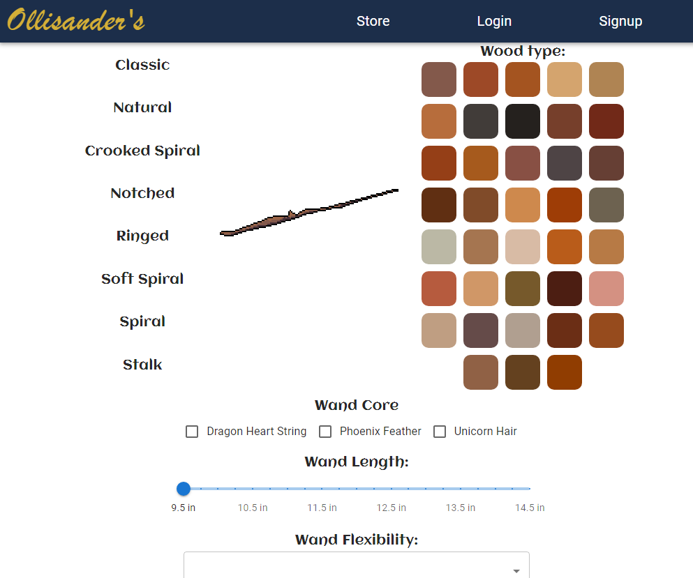

# Ollisander's Wand Store

## Description
Ollisander's Wand Store is a MERN Stack application. This app uses a React front end, a node.js and express.js backend, and a MONGODB server to create a store page where users can create and customize a magic wand.

## Table of Contents
[Description](#Description) 
[Usage](#Usage) 
[Screenshot](#Screenshot) 
[Credits](#Credits) 
[Link](#Link)

## Usage
Once navigating the deployed url, users can click on the door to enter the store. After creating an account or logging in, users can create their own wand by selecting a wand style, color, core, length, and flexibility. After clicking the "Is this your wand?" button, users will either receive a message that the wand did not choose them and to try again, or will be directed to Stripe where they can buy their wand.

## Screenshot

## Credits
Collaborators:

<a href="https://github.com/sifrult">Amy Snarr</a> 
<a href="https://github.com/Styrlingjohn">Styring Morris</a> 
<a href="https://github.com/brenda255">Brenda Sendejas</a> 
<a href="https://github.com/ecadena7">Eli Cadena</a> 
<a href="https://github.com/Ksteed8859">Kate Steed</a> 

## Link
Click <a href="https://wizard-wands-production-156b.up.railway.app">here</a> to view deployed app.
